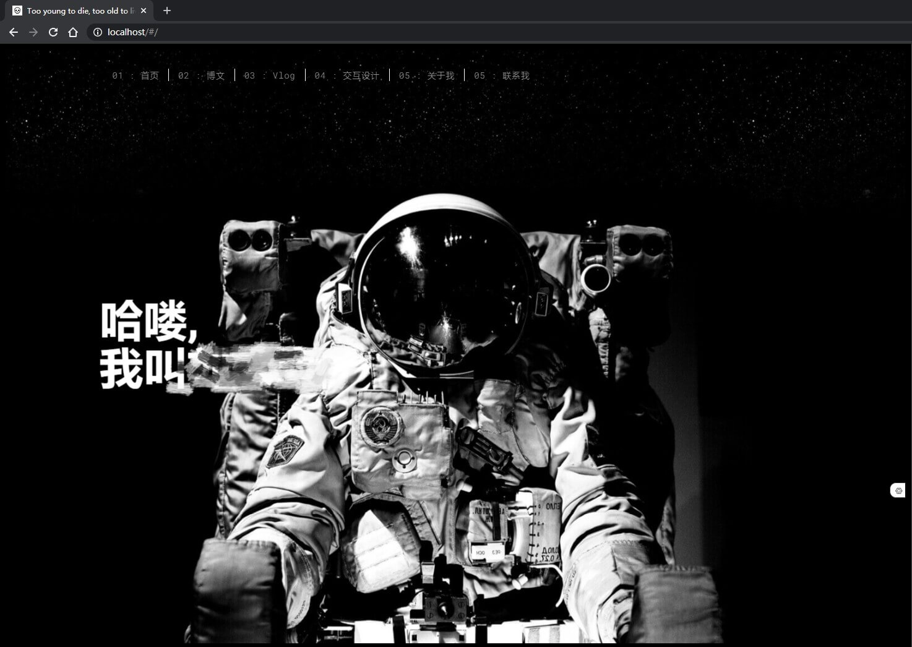
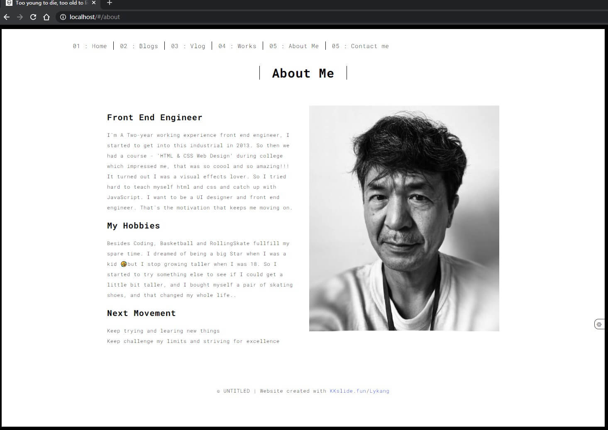
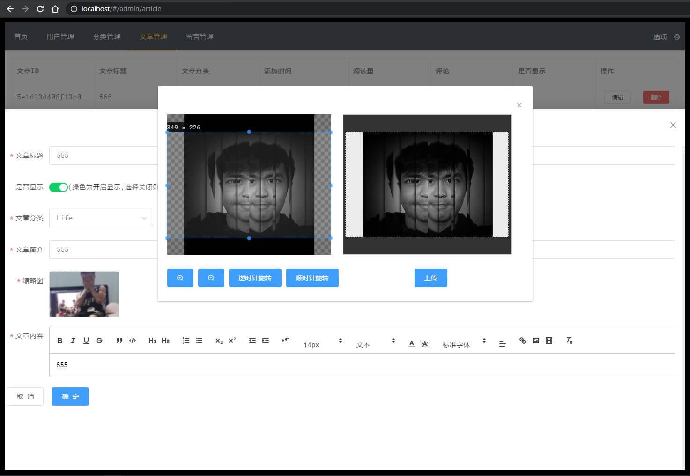
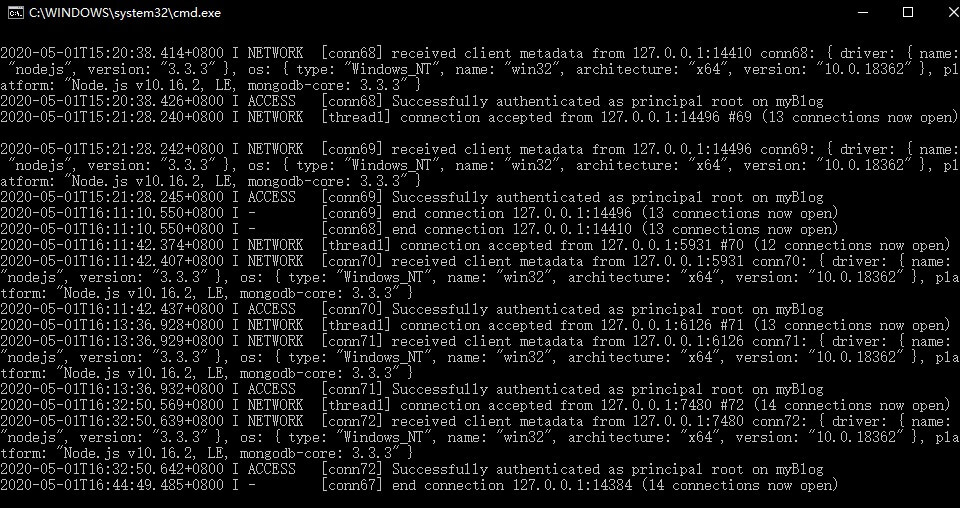

# ExpressBlog

*👉 link online: [http://www.kkslide.fun](http://www.kkslide.fun)*

***

基于`Vue2.0`、`express`和`MySQL`的个人网站。   

## 主要功能：
- 前端首页，文章列表，详情页面，视频播放，视频弹幕和评论，留言功能
- 前端页面是响应式可以适配移动端，并且支持中英切换
- 前端文章页面暂未支持回复功能，努力ing... 😥
- 管理后台支持访页面问量统计，留言、分类和文章添加，删除，编辑等，支持图片裁切上传。
- 更多后续功能慢慢研究😁

## 截图：
<div>    


</div> 

<div>    

</div>  
<div>

</div>
<div>

</div>

***

### 说明
#### 环境：
- Nodejs v10.0+
- MySQLDB v5.7+
- Vue v2.5+

#### 前端：
刚打开项目，乍一看会是个前端的文件夹

但其实服务端也包括在里面，服务端在`/server`目录下

- 在根目录下执行 `npm install` 安装前端依赖。
- 进入到`/server`目录执行 `npm install` 安装服务端依赖


- 去官网下载Mysql数据库 [👉下载地址](https://dev.mysql.com/downloads/mysql/)


## 运行: 
- 数据库中导入myblog.sql脚本

- 启动MySQL数据库
<!-- <div>

</div> -->

- 修改`server/db/index.js` 修改数据库配置，如下所示：
```javascript
    const mysql = require("mysql");
    const pool = mysql.createPool({
        host: "localhost",
        user: "root",
        password: "rootroot",
        port: '3306',
        database: "myblog"
    });
```

- 在`/`根目录下 `npm run dev` 运行开发环境
- 在`/server`目录下 `npm start` 运行服务端
- 打开👉[http://localhost:8080](http://localhost:8080)即可

***
## 总结：
虽然博客和个人网站这种类型的项目已经一搜一大把了

纸上得来终觉浅 绝知此事要躬行 🤐

从写静态页面到用Vue框架改造

再自己用express写服务端

买服务器, 备案域名, 实现七牛云对象存储, 搭建CentOS环境, 再部署项目

表面上内容和功能虽然简单,但也感觉获益颇丰了

下一步打算尝试用别的后台语言技术实现服务端😁

🙏🙏🙏
